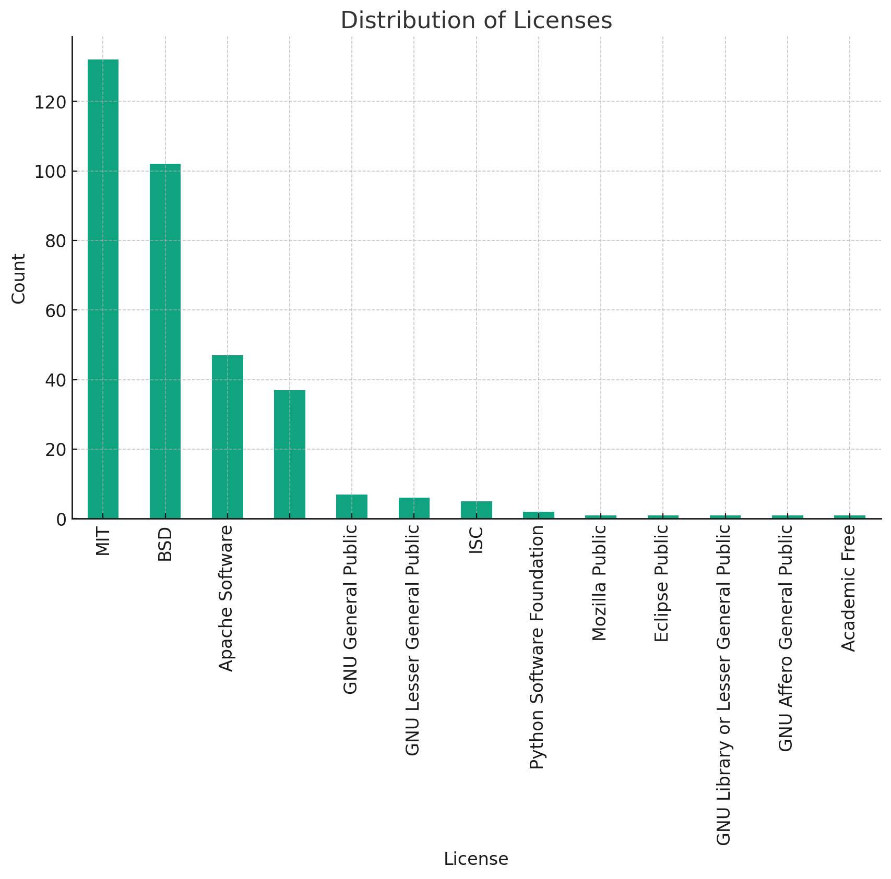

# Python of Chatgpt Code Interpreter Model

Python version: 3.8.10

## Package Analyse

### Install

All packages for now list in [requirements.txt](./requirements.txt), you can install locally by `pip install -r requirements.txt`

### GPT analyse



### Packages Table

| Name                      | Summary                                                                                                                                                                                       | License                              | Homepage                                                        | Source                                                         | PyPi Link                                           |
|---------------------------|-----------------------------------------------------------------------------------------------------------------------------------------------------------------------------------------------|--------------------------------------|-----------------------------------------------------------------|----------------------------------------------------------------|-----------------------------------------------------|
| Babel                     | Internationalization utilities                                                                                                                                                                | BSD                                  | https://babel.pocoo.org/                                        | https://github.com/python-babel/babel                          | https://pypi.org/project/Babel/                     |
| Brotli                    | Python bindings for the Brotli compression library                                                                                                                                            | MIT                                  | https://github.com/google/brotli                                | https://github.com/google/brotli                               | https://pypi.org/project/Brotli/                    |
| CairoSVG                  | A Simple SVG Converter based on Cairo                                                                                                                                                         | GNU Lesser General Public            | https://courtbouillon.org/cairosvg                              | N/A                                                            | https://pypi.org/project/CairoSVG/                  |
| EbookLib                  | Ebook library which can handle EPUB2/EPUB3 and Kindle format                                                                                                                                  |                                      | https://github.com/aerkalov/ebooklib                            | https://github.com/aerkalov/ebooklib                           | https://pypi.org/project/EbookLib/                  |
| Faker                     | Faker is a Python package that generates fake data for you.                                                                                                                                   | MIT                                  | https://github.com/joke2k/faker                                 | https://github.com/joke2k/faker                                | https://pypi.org/project/Faker/                     |
| Fiona                     | Fiona reads and writes spatial data files                                                                                                                                                     | BSD                                  | N/A                                                             | N/A                                                            | https://pypi.org/project/Fiona/                     |
| Flask                     | A simple framework for building complex web applications.                                                                                                                                     | BSD                                  | [Welcome to Flask](https://flask.palletsprojects.com/en/2.3.x/) | [pallets/flask](https://github.com/pallets/flask/)             | https://pypi.org/project/Flask/                     |
| Flask-CacheBuster         | Flask-CacheBuster is a lightweight Flask extension that adds a hash to the URL query parameters of each static file.                                                                          | MIT                                  | https://github.com/israel-fl/Flask-CacheBuster                  | N/A                                                            | https://pypi.org/project/Flask-CacheBuster/         |
| Flask-Cors                | A Flask extension adding a decorator for CORS support                                                                                                                                         | MIT                                  | https://github.com/corydolphin/flask-cors                       | N/A                                                            | https://pypi.org/project/Flask-Cors/                |
| Flask-Login               | User authentication and session management for Flask.                                                                                                                                         | MIT                                  | https://github.com/maxcountryman/flask-login                    | N/A                                                            | https://pypi.org/project/Flask-Login/               |
| IMAPClient                | Easy-to-use, Pythonic and complete IMAP client library                                                                                                                                        | BSD                                  | https://github.com/mjs/imapclient/                              | N/A                                                            | https://pypi.org/project/IMAPClient/                |
| Jinja2                    | A very fast and expressive template engine.                                                                                                                                                   | BSD                                  | https://palletsprojects.com/p/jinja/                            | N/A                                                            | https://pypi.org/project/Jinja2/                    |
| MarkupSafe                | Safely add untrusted strings to HTML/XML markup.                                                                                                                                              | BSD                                  | https://palletsprojects.com/p/markupsafe/                       | N/A                                                            | https://pypi.org/project/MarkupSafe/                |
| Pillow                    | Python Imaging Library (Fork)                                                                                                                                                                 |                                      | https://python-pillow.org                                       | https://github.com/python-pillow/Pillow                        | https://pypi.org/project/Pillow/                    |
| PyAudio                   | Cross-platform audio I/O with PortAudio                                                                                                                                                       | MIT                                  | https://people.csail.mit.edu/hubert/pyaudio/                    | N/A                                                            | https://pypi.org/project/PyAudio/                   |
| PyGObject                 | Python bindings for GObject Introspection                                                                                                                                                     | GNU Lesser General Public            | https://pygobject.readthedocs.io                                | N/A                                                            | https://pypi.org/project/PyGObject/                 |
| PyMuPDF                   | Python bindings for the PDF toolkit and renderer MuPDF                                                                                                                                        |                                      | https://github.com/pymupdf/PyMuPDF                              | https://github.com/pymupdf/pymupdf                             | https://pypi.org/project/PyMuPDF/                   |
| PyNaCl                    | Python binding to the Networking and Cryptography (NaCl) library                                                                                                                              |                                      | https://github.com/pyca/pynacl/                                 | N/A                                                            | https://pypi.org/project/PyNaCl/                    |
| PyPDF2                    | A pure-python PDF library capable of splitting, merging, cropping, and transforming PDF files                                                                                                 | BSD                                  | N/A                                                             | https://github.com/py-pdf/PyPDF2                               | https://pypi.org/project/PyPDF2/                    |
| PyWavelets                | PyWavelets, wavelet transform module                                                                                                                                                          | MIT                                  | https://github.com/PyWavelets/pywt                              | N/A                                                            | https://pypi.org/project/PyWavelets/                |
| PyYAML                    | YAML parser and emitter for Python                                                                                                                                                            | MIT                                  | https://pyyaml.org/                                             | N/A                                                            | https://pypi.org/project/PyYAML/                    |
| Pygments                  | Pygments is a syntax highlighting package written in Python.                                                                                                                                  | BSD                                  | https://pygments.org                                            | https://github.com/pygments/pygments                           | https://pypi.org/project/Pygments/                  |
| Send2Trash                | Send file to trash natively under Mac OS X, Windows and Linux                                                                                                                                 | BSD                                  | https://github.com/arsenetar/send2trash                         | N/A                                                            | https://pypi.org/project/Send2Trash/                |
| Shapely                   | Manipulation and analysis of geometric objects                                                                                                                                                | BSD                                  | N/A                                                             | N/A                                                            | https://pypi.org/project/Shapely/                   |
| SoundFile                 | An audio library based on libsndfile, CFFI and NumPy                                                                                                                                          | BSD                                  | https://github.com/bastibe/python-soundfile                     | N/A                                                            | https://pypi.org/project/SoundFile/                 |
| SpeechRecognition         | Library for performing speech recognition, with support for several engines and APIs, online and offline.                                                                                     | BSD                                  | https://github.com/Uberi/speech_recognition#readme              | N/A                                                            | https://pypi.org/project/SpeechRecognition/         |
| Theano-PyMC               | Optimizing compiler for evaluating mathematical expressions on CPUs and GPUs.                                                                                                                 | BSD                                  | http://deeplearning.net/software/theano/                        | N/A                                                            | https://pypi.org/project/Theano-PyMC/               |
| Wand                      | Ctypes-based simple MagickWand API binding for Python                                                                                                                                         | MIT                                  | http://wand-py.org/                                             | https://github.com/emcconville/wand                            | https://pypi.org/project/Wand/                      |
| Werkzeug                  | The comprehensive WSGI web application library.                                                                                                                                               | BSD                                  | N/A                                                             | N/A                                                            | https://pypi.org/project/Werkzeug/                  |
| XlsxWriter                | A Python module for creating Excel XLSX files.                                                                                                                                                | BSD                                  | https://github.com/jmcnamara/XlsxWriter                         | N/A                                                            | https://pypi.org/project/XlsxWriter/                |
| absl-py                   | Abseil Python Common Libraries, see https://github.com/abseil/abseil-py.                                                                                                                      | Apache Software                      | https://github.com/abseil/abseil-py                             | N/A                                                            | https://pypi.org/project/absl-py/                   |
| affine                    | Matrices describing affine transformation of the plane                                                                                                                                        | BSD                                  | N/A                                                             | https://github.com/rasterio/affine                             | https://pypi.org/project/affine/                    |
| aiohttp                   | Async http client/server framework (asyncio)                                                                                                                                                  | Apache Software                      | https://github.com/aio-libs/aiohttp                             | N/A                                                            | https://pypi.org/project/aiohttp/                   |
| aiosignal                 | aiosignal: a list of registered asynchronous callbacks                                                                                                                                        | Apache Software                      | https://github.com/aio-libs/aiosignal                           | N/A                                                            | https://pypi.org/project/aiosignal/                 |
| analytics-python          | The hassle-free way to integrate analytics into any python application.                                                                                                                       | MIT                                  | https://github.com/segmentio/analytics-python                   | N/A                                                            | https://pypi.org/project/analytics-python/          |
| anyio                     | High level compatibility layer for multiple asynchronous event loop implementations                                                                                                           | MIT                                  | N/A                                                             | N/A                                                            | https://pypi.org/project/anyio/                     |
| anytree                   | Powerful and Lightweight Python Tree Data Structure with various plugins                                                                                                                      | MIT                                  | https://github.com/c0fec0de/anytree                             | N/A                                                            | https://pypi.org/project/anytree/                   |
| argcomplete               | Bash tab completion for argparse                                                                                                                                                              | Apache Software                      | https://github.com/kislyuk/argcomplete                          | N/A                                                            | https://pypi.org/project/argcomplete/               |
| argon2-cffi               | The secure Argon2 password hashing algorithm.                                                                                                                                                 | MIT                                  | N/A                                                             | N/A                                                            | https://pypi.org/project/argon2-cffi/               |
| argon2-cffi-bindings      | Low-level CFFI bindings for Argon2                                                                                                                                                            | MIT                                  | https://github.com/hynek/argon2-cffi-bindings                   | N/A                                                            | https://pypi.org/project/argon2-cffi-bindings/      |
| arviz                     | Exploratory analysis of Bayesian models                                                                                                                                                       | Apache Software                      | http://github.com/arviz-devs/arviz                              | N/A                                                            | https://pypi.org/project/arviz/                     |
| asttokens                 | Annotate AST trees with source code positions                                                                                                                                                 |                                      | https://github.com/gristlabs/asttokens                          | N/A                                                            | https://pypi.org/project/asttokens/                 |
| async-timeout             | Timeout context manager for asyncio programs                                                                                                                                                  | Apache Software                      | https://github.com/aio-libs/async-timeout                       | N/A                                                            | https://pypi.org/project/async-timeout/             |
| attrs                     | Classes Without Boilerplate                                                                                                                                                                   | MIT                                  | N/A                                                             | N/A                                                            | https://pypi.org/project/attrs/                     |
| audioread                 | multi-library, cross-platform audio decoding                                                                                                                                                  |                                      | https://github.com/sampsyo/audioread                            | N/A                                                            | https://pypi.org/project/audioread/                 |
| backcall                  | Specifications for callback functions passed in to an API                                                                                                                                     | BSD                                  | https://github.com/takluyver/backcall                           | N/A                                                            | https://pypi.org/project/backcall/                  |
| backoff                   | Function decoration for backoff and retry                                                                                                                                                     | MIT                                  | https://github.com/litl/backoff                                 | N/A                                                            | https://pypi.org/project/backoff/                   |
| backports.zoneinfo        | Backport of the standard library zoneinfo module                                                                                                                                              | Apache Software                      | https://github.com/pganssle/zoneinfo                            | https://github.com/pganssle/zoneinfo                           | https://pypi.org/project/backports.zoneinfo/        |
| basemap                   | Plot data on map projections with matplotlib                                                                                                                                                  | MIT                                  | https://matplotlib.org/basemap                                  | https://github.com/matplotlib/basemap                          | https://pypi.org/project/basemap/                   |
| basemap-data              | Data assets for matplotlib basemap                                                                                                                                                            | GNU Lesser General Public            | https://matplotlib.org/basemap                                  | https://github.com/matplotlib/basemap                          | https://pypi.org/project/basemap-data/              |
| bcrypt                    | Modern password hashing for your software and your servers                                                                                                                                    | Apache Software                      | https://github.com/pyca/bcrypt/                                 | N/A                                                            | https://pypi.org/project/bcrypt/                    |
| beautifulsoup4            | Screen-scraping library                                                                                                                                                                       | MIT                                  | https://www.crummy.com/software/BeautifulSoup/bs4/              | N/A                                                            | https://pypi.org/project/beautifulsoup4/            |
| bleach                    | An easy safelist-based HTML-sanitizing tool.                                                                                                                                                  | Apache Software                      | https://github.com/mozilla/bleach                               | N/A                                                            | https://pypi.org/project/bleach/                    |
| blinker                   | Fast, simple object-to-object and broadcast signaling                                                                                                                                         | MIT                                  | https://blinker.readthedocs.io                                  | N/A                                                            | https://pypi.org/project/blinker/                   |
| blis                      | The Blis BLAS-like linear algebra library, as a self-contained C-extension.                                                                                                                   | BSD                                  | https://github.com/explosion/cython-blis                        | N/A                                                            | https://pypi.org/project/blis/                      |
| bokeh                     | Interactive plots and applications in the browser from Python                                                                                                                                 | BSD                                  | N/A                                                             | N/A                                                            | https://pypi.org/project/bokeh/                     |
| branca                    | Generate complex HTML+JS pages with Python                                                                                                                                                    | MIT                                  | https://github.com/python-visualization/branca                  | N/A                                                            | https://pypi.org/project/branca/                    |
| cachetools                | Extensible memoizing collections and decorators                                                                                                                                               | MIT                                  | https://github.com/tkem/cachetools/                             | N/A                                                            | https://pypi.org/project/cachetools/                |
| cairocffi                 | cffi-based cairo bindings for Python                                                                                                                                                          | BSD                                  | N/A                                                             | N/A                                                            | https://pypi.org/project/cairocffi/                 |
| camelot-py                | PDF Table Extraction for Humans.                                                                                                                                                              | MIT                                  | http://camelot-py.readthedocs.io/                               | N/A                                                            | https://pypi.org/project/camelot-py/                |
| catalogue                 | Super lightweight function registries for your library                                                                                                                                        | MIT                                  | https://github.com/explosion/catalogue                          | N/A                                                            | https://pypi.org/project/catalogue/                 |
| certifi                   | Python package for providing Mozilla's CA Bundle.                                                                                                                                             | Mozilla Public                       | https://github.com/certifi/python-certifi                       | https://github.com/certifi/python-certifi                      | https://pypi.org/project/certifi/                   |
| cffi                      | Foreign Function Interface for Python calling C code.                                                                                                                                         | MIT                                  | http://cffi.readthedocs.org                                     | N/A                                                            | https://pypi.org/project/cffi/                      |
| chardet                   | Universal encoding detector for Python 3                                                                                                                                                      | GNU Lesser General Public            | https://github.com/chardet/chardet                              | N/A                                                            | https://pypi.org/project/chardet/                   |
| charset-normalizer        | The Real First Universal Charset Detector. Open, modern and actively maintained alternative to Chardet.                                                                                       | MIT                                  | https://github.com/Ousret/charset_normalizer                    | N/A                                                            | https://pypi.org/project/charset-normalizer/        |
| click                     | Composable command line interface toolkit                                                                                                                                                     | BSD                                  | https://palletsprojects.com/p/click/                            | N/A                                                            | https://pypi.org/project/click/                     |
| click-plugins             | An extension module for click to enable registering CLI commands via setuptools entry-points.                                                                                                 | BSD                                  | https://github.com/click-contrib/click-plugins                  | N/A                                                            | https://pypi.org/project/click-plugins/             |
| cligj                     | Click params for commmand line interfaces to GeoJSON                                                                                                                                          |                                      | https://github.com/mapbox/cligj                                 | N/A                                                            | https://pypi.org/project/cligj/                     |
| cloudpickle               | Extended pickling support for Python objects                                                                                                                                                  | BSD                                  | https://github.com/cloudpipe/cloudpickle                        | N/A                                                            | https://pypi.org/project/cloudpickle/               |
| cmudict                   | A versioned python wrapper package for The CMU Pronouncing Dictionary data files.                                                                                                             | GNU General Public                   | https://github.com/prosegrinder/python-cmudict                  | N/A                                                            | https://pypi.org/project/cmudict/                   |
| comm                      | Jupyter Python Comm implementation, for usage in ipykernel, xeus-python etc.                                                                                                                  | BSD                                  | https://github.com/ipython/comm                                 | N/A                                                            | https://pypi.org/project/comm/                      |
| compressed-rtf            | Compressed Rich Text Format (RTF) compression and decompression package                                                                                                                       | MIT                                  | https://github.com/delimitry/compressed_rtf                     | N/A                                                            | https://pypi.org/project/compressed-rtf/            |
| countryinfo               | countryinfo is a python module for returning data about countries, ISO info and states/provinces within them.                                                                                 | MIT                                  | https://github.com/porimol/countryinfo                          | N/A                                                            | https://pypi.org/project/countryinfo/               |
| cryptography              | cryptography is a package which provides cryptographic recipes and primitives to Python developers.                                                                                           | Apache Software                      | N/A                                                             | N/A                                                            | https://pypi.org/project/cryptography/              |
| cssselect2                | CSS selectors for Python ElementTree                                                                                                                                                          | BSD                                  | https://doc.courtbouillon.org/cssselect2/                       | N/A                                                            | https://pypi.org/project/cssselect2/                |
| cycler                    | Composable style cycles                                                                                                                                                                       | BSD                                  | https://github.com/matplotlib/cycler                            | N/A                                                            | https://pypi.org/project/cycler/                    |
| cymem                     | Manage calls to calloc/free through Cython                                                                                                                                                    | MIT                                  | https://github.com/explosion/cymem                              | N/A                                                            | https://pypi.org/project/cymem/                     |
| dbus-python               | Python bindings for libdbus                                                                                                                                                                   | MIT                                  | http://www.freedesktop.org/wiki/Software/DBusBindings/#python   | https://gitlab.freedesktop.org/dbus/dbus-python/               | https://pypi.org/project/dbus-python/               |
| debugpy                   | An implementation of the Debug Adapter Protocol for Python                                                                                                                                    | Eclipse Public                       | https://aka.ms/debugpy                                          | https://github.com/microsoft/debugpy                           | https://pypi.org/project/debugpy/                   |
| decorator                 | Decorators for Humans                                                                                                                                                                         | BSD                                  | https://github.com/micheles/decorator                           | N/A                                                            | https://pypi.org/project/decorator/                 |
| defusedxml                | XML bomb protection for Python stdlib modules                                                                                                                                                 | Python Software Foundation           | https://github.com/tiran/defusedxml                             | N/A                                                            | https://pypi.org/project/defusedxml/                |
| deprecat                  | Python @deprecat decorator to deprecate old python classes, functions or methods.                                                                                                             | MIT                                  | https://github.com/deprecat/deprecat                            | N/A                                                            | https://pypi.org/project/deprecat/                  |
| dill                      | serialize all of python                                                                                                                                                                       | BSD                                  | https://github.com/uqfoundation/dill                            | N/A                                                            | https://pypi.org/project/dill/                      |
| distro-info               | No project description provided                                                                                                                                                               |                                      | https://salsa.debian.org/debian/distro-info                     | N/A                                                            | https://pypi.org/project/distro-info/               |
| dlib                      | A toolkit for making real world machine learning and data analysis applications                                                                                                               |                                      | https://github.com/davisking/dlib                               | N/A                                                            | https://pypi.org/project/dlib/                      |
| dnspython                 | DNS toolkit                                                                                                                                                                                   |                                      | https://www.dnspython.org                                       | N/A                                                            | https://pypi.org/project/dnspython/                 |
| docx2txt                  | A pure python-based utility to extract text and images from docx files.                                                                                                                       |                                      | https://github.com/ankushshah89/python-docx2txt                 | N/A                                                            | https://pypi.org/project/docx2txt/                  |
| ebcdic                    | Additional EBCDIC codecs                                                                                                                                                                      | BSD                                  | https://pypi.python.org/pypi/ebcdic                             | N/A                                                            | https://pypi.org/project/ebcdic/                    |
| einops                    | A new flavour of deep learning operations                                                                                                                                                     | MIT                                  | https://github.com/arogozhnikov/einops                          | N/A                                                            | https://pypi.org/project/einops/                    |
| email-validator           | A robust email address syntax and deliverability validation library.                                                                                                                          |                                      | https://github.com/JoshData/python-email-validator              | N/A                                                            | https://pypi.org/project/email-validator/           |
| entrypoints               | Discover and load entry points from installed packages.                                                                                                                                       | MIT                                  | https://github.com/takluyver/entrypoints                        | N/A                                                            | https://pypi.org/project/entrypoints/               |
| et-xmlfile                | An implementation of lxml.xmlfile for the standard library                                                                                                                                    | MIT                                  | https://foss.heptapod.net/openpyxl/et_xmlfile                   | N/A                                                            | https://pypi.org/project/et-xmlfile/                |
| exceptiongroup            | Backport of PEP 654 (exception groups)                                                                                                                                                        | MIT                                  | N/A                                                             | N/A                                                            | https://pypi.org/project/exceptiongroup/            |
| exchange-calendars        | Calendars for securities exchanges                                                                                                                                                            | Apache Software                      | N/A                                                             | N/A                                                            | https://pypi.org/project/exchange-calendars/        |
| executing                 | Get the currently executing AST node of a frame, and other information                                                                                                                        | MIT                                  | https://github.com/alexmojaki/executing                         | N/A                                                            | https://pypi.org/project/executing/                 |
| extract-msg               | Extracts emails and attachments saved in Microsoft Outlook's .msg files                                                                                                                       |                                      | https://github.com/TeamMsgExtractor/msg-extractor               | N/A                                                            | https://pypi.org/project/extract-msg/               |
| fastapi                   | FastAPI framework, high performance, easy to learn, fast to code, ready for production                                                                                                        | MIT                                  | https://github.com/tiangolo/fastapi                             | N/A                                                            | https://pypi.org/project/fastapi/                   |
| fastjsonschema            | Fastest Python implementation of JSON schema                                                                                                                                                  | BSD                                  | https://github.com/horejsek/python-fastjsonschema               | N/A                                                            | https://pypi.org/project/fastjsonschema/            |
| fastprogress              | A nested progress with plotting options for fastai                                                                                                                                            | Apache Software                      | https://github.com/fastai/fastprogress                          | N/A                                                            | https://pypi.org/project/fastprogress/              |
| ffmpeg-python             | Python bindings for FFmpeg - with complex filtering support                                                                                                                                   | Apache Software                      | https://github.com/kkroening/ffmpeg-python                      | N/A                                                            | https://pypi.org/project/ffmpeg-python/             |
| ffmpy                     | A simple Python wrapper for ffmpeg                                                                                                                                                            | MIT                                  | https://github.com/Ch00k/ffmpy                                  | N/A                                                            | https://pypi.org/project/ffmpy/                     |
| filelock                  | A platform independent file lock.                                                                                                                                                             |                                      | https://github.com/tox-dev/py-filelock                          | https://github.com/tox-dev/py-filelock                         | https://pypi.org/project/filelock/                  |
| folium                    | Make beautiful maps with Leaflet.js & Python                                                                                                                                                  | MIT                                  | https://github.com/python-visualization/folium                  | N/A                                                            | https://pypi.org/project/folium/                    |
| fonttools                 | Tools to manipulate font files                                                                                                                                                                | MIT                                  | http://github.com/fonttools/fonttools                           | N/A                                                            | https://pypi.org/project/fonttools/                 |
| fpdf                      | Simple PDF generation for Python                                                                                                                                                              | GNU Lesser General Public            | http://code.google.com/p/pyfpdf                                 | N/A                                                            | https://pypi.org/project/fpdf/                      |
| frozenlist                | A list-like structure which implements collections.abc.MutableSequence                                                                                                                        | Apache Software                      | https://github.com/aio-libs/frozenlist                          | N/A                                                            | https://pypi.org/project/frozenlist/                |
| future                    | Clean single-source support for Python 3 and 2                                                                                                                                                | MIT                                  | https://python-future.org                                       | N/A                                                            | https://pypi.org/project/future/                    |
| fuzzywuzzy                | Fuzzy string matching in python                                                                                                                                                               | GNU General Public                   | https://github.com/seatgeek/fuzzywuzzy                          | N/A                                                            | https://pypi.org/project/fuzzywuzzy/                |
| gTTS                      | gTTS (Google Text-to-Speech), a Python library and CLI tool to interface with Google Translate text-to-speech API                                                                             | MIT                                  | N/A                                                             | N/A                                                            | https://pypi.org/project/gTTS/                      |
| gensim                    | Python framework for fast Vector Space Modelling                                                                                                                                              |                                      | http://radimrehurek.com/gensim                                  | https://github.com/RaRe-Technologies/gensim                    | https://pypi.org/project/gensim/                    |
| geographiclib             | The geodesic routines from GeographicLib                                                                                                                                                      | MIT                                  | https://geographiclib.sourceforge.io/Python/2.0                 | N/A                                                            | https://pypi.org/project/geographiclib/             |
| geopandas                 | Geographic pandas extensions                                                                                                                                                                  | BSD                                  | N/A                                                             | N/A                                                            | https://pypi.org/project/geopandas/                 |
| geopy                     | Python Geocoding Toolbox                                                                                                                                                                      | MIT                                  | https://github.com/geopy/geopy                                  | N/A                                                            | https://pypi.org/project/geopy/                     |
| gradio                    | Python library for easily interacting with trained machine learning models                                                                                                                    | Apache Software                      | https://github.com/gradio-app/gradio                            | N/A                                                            | https://pypi.org/project/gradio/                    |
| graphviz                  | Simple Python interface for Graphviz                                                                                                                                                          | MIT                                  | https://github.com/xflr6/graphviz                               | N/A                                                            | https://pypi.org/project/graphviz/                  |
| h11                       | A pure-Python, bring-your-own-I/O implementation of HTTP/1.1                                                                                                                                  | MIT                                  | https://github.com/python-hyper/h11                             | N/A                                                            | https://pypi.org/project/h11/                       |
| h2                        | HTTP/2 State-Machine based protocol implementation                                                                                                                                            | MIT                                  | https://github.com/python-hyper/h2                              | N/A                                                            | https://pypi.org/project/h2/                        |
| h5netcdf                  | netCDF4 via h5py                                                                                                                                                                              | BSD                                  | N/A                                                             | N/A                                                            | https://pypi.org/project/h5netcdf/                  |
| h5py                      | Read and write HDF5 files from Python                                                                                                                                                         | BSD                                  | https://www.h5py.org/                                           | https://github.com/h5py/h5py                                   | https://pypi.org/project/h5py/                      |
| hpack                     | Pure-Python HPACK header compression                                                                                                                                                          | MIT                                  | https://github.com/python-hyper/hpack                           | N/A                                                            | https://pypi.org/project/hpack/                     |
| html5lib                  | HTML parser based on the WHATWG HTML specification                                                                                                                                            | MIT                                  | https://github.com/html5lib/html5lib-python                     | N/A                                                            | https://pypi.org/project/html5lib/                  |
| httpcore                  | A minimal low-level HTTP client.                                                                                                                                                              | BSD                                  | https://github.com/encode/httpcore                              | https://github.com/encode/httpcore                             | https://pypi.org/project/httpcore/                  |
| httptools                 | A collection of framework independent HTTP protocol utils.                                                                                                                                    | MIT                                  | https://github.com/MagicStack/httptools                         | N/A                                                            | https://pypi.org/project/httptools/                 |
| httpx                     | The next generation HTTP client.                                                                                                                                                              | BSD                                  | https://github.com/encode/httpx                                 | https://github.com/encode/httpx                                | https://pypi.org/project/httpx/                     |
| hypercorn                 | A ASGI Server based on Hyper libraries and inspired by Gunicorn                                                                                                                               | MIT                                  | https://github.com/pgjones/hypercorn/                           | N/A                                                            | https://pypi.org/project/hypercorn/                 |
| hyperframe                | HTTP/2 framing layer for Python                                                                                                                                                               | MIT                                  | https://github.com/python-hyper/hyperframe/                     | N/A                                                            | https://pypi.org/project/hyperframe/                |
| idna                      | Internationalized Domain Names in Applications (IDNA)                                                                                                                                         | BSD                                  | N/A                                                             | https://github.com/kjd/idna                                    | https://pypi.org/project/idna/                      |
| imageio                   | Library for reading and writing a wide range of image, video, scientific, and volumetric data formats.                                                                                        | BSD                                  | https://github.com/imageio/imageio                              | N/A                                                            | https://pypi.org/project/imageio/                   |
| imageio-ffmpeg            | FFMPEG wrapper for Python                                                                                                                                                                     | BSD                                  | https://github.com/imageio/imageio-ffmpeg                       | N/A                                                            | https://pypi.org/project/imageio-ffmpeg/            |
| imgkit                    | Wkhtmltopdf python wrapper to convert html to image using the webkit rendering engine and qt                                                                                                  | MIT                                  | https://github.com/jarrekk/imgkit                               | N/A                                                            | https://pypi.org/project/imgkit/                    |
| importlib-metadata        | Read metadata from Python packages                                                                                                                                                            | Apache Software                      | https://github.com/python/importlib_metadata                    | N/A                                                            | https://pypi.org/project/importlib-metadata/        |
| importlib-resources       | Read resources from Python packages                                                                                                                                                           | Apache Software                      | https://github.com/python/importlib_resources                   | N/A                                                            | https://pypi.org/project/importlib-resources/       |
| iniconfig                 | brain-dead simple config-ini parsing                                                                                                                                                          | MIT                                  | https://github.com/pytest-dev/iniconfig                         | N/A                                                            | https://pypi.org/project/iniconfig/                 |
| ipykernel                 | IPython Kernel for Jupyter                                                                                                                                                                    | BSD                                  | https://ipython.org                                             | N/A                                                            | https://pypi.org/project/ipykernel/                 |
| ipython                   | IPython: Productive Interactive Computing                                                                                                                                                     | BSD                                  | https://ipython.org                                             | https://github.com/ipython/ipython                             | https://pypi.org/project/ipython/                   |
| ipython-genutils          | Vestigial utilities from IPython                                                                                                                                                              | BSD                                  | http://ipython.org                                              | N/A                                                            | https://pypi.org/project/ipython-genutils/          |
| isodate                   | An ISO 8601 date/time/duration parser and formatter                                                                                                                                           | BSD                                  | https://github.com/gweis/isodate/                               | N/A                                                            | https://pypi.org/project/isodate/                   |
| itsdangerous              | Safely pass data to untrusted environments and back.                                                                                                                                          | BSD                                  | https://palletsprojects.com/p/itsdangerous/                     | N/A                                                            | https://pypi.org/project/itsdangerous/              |
| jax                       | Differentiate, compile, and transform Numpy code.                                                                                                                                             |                                      | https://github.com/google/jax                                   | N/A                                                            | https://pypi.org/project/jax/                       |
| jedi                      | An autocompletion tool for Python that can be used for text editors.                                                                                                                          | MIT                                  | https://github.com/davidhalter/jedi                             | N/A                                                            | https://pypi.org/project/jedi/                      |
| joblib                    | Lightweight pipelining with Python functions                                                                                                                                                  | BSD                                  | https://joblib.readthedocs.io                                   | https://github.com/joblib/joblib                               | https://pypi.org/project/joblib/                    |
| json5                     | A Python implementation of the JSON5 data format.                                                                                                                                             | Apache Software                      | https://github.com/dpranke/pyjson5                              | N/A                                                            | https://pypi.org/project/json5/                     |
| jsonpickle                | Python library for serializing any arbitrary object graph into JSON                                                                                                                           | BSD                                  | https://github.com/jsonpickle/jsonpickle                        | N/A                                                            | https://pypi.org/project/jsonpickle/                |
| jsonschema                | An implementation of JSON Schema validation for Python                                                                                                                                        | MIT                                  | https://github.com/python-jsonschema/jsonschema                 | https://github.com/python-jsonschema/jsonschema                | https://pypi.org/project/jsonschema/                |
| jsonschema-specifications | The JSON Schema meta-schemas and vocabularies, exposed as a Registry                                                                                                                          | MIT                                  | https://github.com/python-jsonschema/jsonschema-specifications  | https://github.com/python-jsonschema/jsonschema-specifications | https://pypi.org/project/jsonschema-specifications/ |
| jupyter-client            | Jupyter protocol implementation and client libraries                                                                                                                                          | BSD                                  | https://jupyter.org                                             | https://github.com/jupyter/jupyter_client                      | https://pypi.org/project/jupyter-client/            |
| jupyter-core              | Jupyter core package. A base package on which Jupyter projects rely.                                                                                                                          | BSD                                  | https://jupyter.org                                             | https://github.com/jupyter/jupyter_core                        | https://pypi.org/project/jupyter-core/              |
| jupyter-server            | The backend��i.e. core services, APIs, and REST endpoints��to Jupyter web applications.                                                                                                       | BSD                                  | https://jupyter-server.readthedocs.io                           | https://github.com/jupyter-server/jupyter_server               | https://pypi.org/project/jupyter-server/            |
| jupyterlab                | JupyterLab computational environment                                                                                                                                                          | BSD                                  | https://jupyter.org                                             | https://github.com/jupyterlab/jupyterlab                       | https://pypi.org/project/jupyterlab/                |
| jupyterlab-pygments       | Pygments theme using JupyterLab CSS variables                                                                                                                                                 |                                      | https://github.com/jupyterlab/jupyterlab_pygments               | N/A                                                            | https://pypi.org/project/jupyterlab-pygments/       |
| jupyterlab-server         | A set of server components for JupyterLab and JupyterLab like applications.                                                                                                                   | BSD                                  | https://jupyterlab-server.readthedocs.io                        | https://github.com/jupyterlab/jupyterlab_server                | https://pypi.org/project/jupyterlab-server/         |
| keras                     | Deep learning for humans.                                                                                                                                                                     | Apache Software                      | https://keras.io/                                               | N/A                                                            | https://pypi.org/project/keras/                     |
| kerykeion                 | A python library for astrology.                                                                                                                                                               | GNU General Public                   | https://github.com/g-battaglia/kerykeion                        | N/A                                                            | https://pypi.org/project/kerykeion/                 |
| kiwisolver                | A fast implementation of the Cassowary constraint solver                                                                                                                                      | BSD                                  | N/A                                                             | N/A                                                            | https://pypi.org/project/kiwisolver/                |
| korean-lunar-calendar     | Korean Lunar Calendar                                                                                                                                                                         | MIT                                  | https://github.com/usingsky/korean_lunar_calendar_py            | N/A                                                            | https://pypi.org/project/korean-lunar-calendar/     |
| librosa                   | Python module for audio and music processing                                                                                                                                                  | ISC                                  | https://librosa.org                                             | https://github.com/librosa/librosa                             | https://pypi.org/project/librosa/                   |
| llvmlite                  | lightweight wrapper around basic LLVM functionality                                                                                                                                           |                                      | http://llvmlite.readthedocs.io                                  | https://github.com/numba/llvmlite                              | https://pypi.org/project/llvmlite/                  |
| loguru                    | Python logging made (stupidly) simple                                                                                                                                                         | MIT                                  | https://github.com/Delgan/loguru                                | N/A                                                            | https://pypi.org/project/loguru/                    |
| lxml                      | Powerful and Pythonic XML processing library combining libxml2/libxslt with the ElementTree API.                                                                                              | BSD                                  | https://lxml.de/                                                | https://github.com/lxml/lxml                                   | https://pypi.org/project/lxml/                      |
| markdown2                 | A fast and complete Python implementation of Markdown                                                                                                                                         | MIT                                  | https://github.com/trentm/python-markdown2                      | N/A                                                            | https://pypi.org/project/markdown2/                 |
| markdownify               | Convert HTML to markdown.                                                                                                                                                                     | MIT                                  | http://github.com/matthewwithanm/python-markdownify             | N/A                                                            | https://pypi.org/project/markdownify/               |
| matplotlib                | Python plotting package                                                                                                                                                                       | Python Software Foundation           | https://matplotlib.org                                          | N/A                                                            | https://pypi.org/project/matplotlib/                |
| matplotlib-inline         | Inline Matplotlib backend for Jupyter                                                                                                                                                         |                                      | https://github.com/ipython/matplotlib-inline                    | N/A                                                            | https://pypi.org/project/matplotlib-inline/         |
| matplotlib-venn           | Functions for plotting area-proportional two- and three-way Venn diagrams in matplotlib.                                                                                                      | MIT                                  | https://github.com/konstantint/matplotlib-venn                  | N/A                                                            | https://pypi.org/project/matplotlib-venn/           |
| mistune                   | A sane and fast Markdown parser with useful plugins and renderers                                                                                                                             | BSD                                  | N/A                                                             | https://github.com/lepture/mistune                             | https://pypi.org/project/mistune/                   |
| mizani                    | Scales for Python                                                                                                                                                                             | BSD                                  | N/A                                                             | N/A                                                            | https://pypi.org/project/mizani/                    |
| mne                       | MNE-Python project for MEG and EEG data analysis.                                                                                                                                             |                                      | https://mne.tools/                                              | N/A                                                            | https://pypi.org/project/mne/                       |
| monotonic                 | An implementation of time.monotonic() for Python 2 & < 3.3                                                                                                                                    | Apache Software                      | https://github.com/atdt/monotonic                               | N/A                                                            | https://pypi.org/project/monotonic/                 |
| moviepy                   | Video editing with Python                                                                                                                                                                     | MIT                                  | https://zulko.github.io/moviepy/                                | N/A                                                            | https://pypi.org/project/moviepy/                   |
| mpmath                    | Python library for arbitrary-precision floating-point arithmetic                                                                                                                              | BSD                                  | http://mpmath.org/                                              | https://github.com/fredrik-johansson/mpmath                    | https://pypi.org/project/mpmath/                    |
| mtcnn                     | Multi-task Cascaded Convolutional Neural Networks for Face Detection, based on TensorFlow                                                                                                     |                                      | http://github.com/ipazc/mtcnn                                   | N/A                                                            | https://pypi.org/project/mtcnn/                     |
| multidict                 | multidict implementation                                                                                                                                                                      | Apache Software                      | https://github.com/aio-libs/multidict                           | N/A                                                            | https://pypi.org/project/multidict/                 |
| munch                     | A dot-accessible dictionary (a la JavaScript objects)                                                                                                                                         | MIT                                  | https://github.com/Infinidat/munch                              | N/A                                                            | https://pypi.org/project/munch/                     |
| murmurhash                | Cython bindings for MurmurHash                                                                                                                                                                | MIT                                  | https://github.com/explosion/murmurhash                         | N/A                                                            | https://pypi.org/project/murmurhash/                |
| mutagen                   | read and write audio tags for many formats                                                                                                                                                    | GNU General Public                   | https://github.com/quodlibet/mutagen                            | N/A                                                            | https://pypi.org/project/mutagen/                   |
| nashpy                    | A library with algorithms on 2 player games.                                                                                                                                                  | MIT                                  | https://vknight.org                                             | N/A                                                            | https://pypi.org/project/nashpy/                    |
| nbclassic                 | Jupyter Notebook as a Jupyter Server extension.                                                                                                                                               | BSD                                  | https://github.com/jupyter/nbclassic                            | N/A                                                            | https://pypi.org/project/nbclassic/                 |
| nbclient                  | A client library for executing notebooks. Formerly nbconvert's ExecutePreprocessor.                                                                                                           | BSD                                  | https://jupyter.org                                             | https://github.com/jupyter/nbclient                            | https://pypi.org/project/nbclient/                  |
| nbconvert                 | Converting Jupyter Notebooks                                                                                                                                                                  | BSD                                  | https://jupyter.org                                             | N/A                                                            | https://pypi.org/project/nbconvert/                 |
| nbformat                  | The Jupyter Notebook format                                                                                                                                                                   | BSD                                  | https://jupyter.org                                             | N/A                                                            | https://pypi.org/project/nbformat/                  |
| nest-asyncio              | Patch asyncio to allow nested event loops                                                                                                                                                     | BSD                                  | https://github.com/erdewit/nest_asyncio                         | N/A                                                            | https://pypi.org/project/nest-asyncio/              |
| networkx                  | Python package for creating and manipulating graphs and networks                                                                                                                              | BSD                                  | https://networkx.org/                                           | N/A                                                            | https://pypi.org/project/networkx/                  |
| nltk                      | Natural Language Toolkit                                                                                                                                                                      | Apache Software                      | https://www.nltk.org/                                           | N/A                                                            | https://pypi.org/project/nltk/                      |
| notebook                  | A web-based notebook environment for interactive computing                                                                                                                                    | BSD                                  | http://jupyter.org                                              | N/A                                                            | https://pypi.org/project/notebook/                  |
| notebook-shim             | A shim layer for notebook traits and config                                                                                                                                                   | BSD                                  | N/A                                                             | N/A                                                            | https://pypi.org/project/notebook-shim/             |
| numba                     | compiling Python code using LLVM                                                                                                                                                              | BSD                                  | https://numba.pydata.org                                        | N/A                                                            | https://pypi.org/project/numba/                     |
| numexpr                   | Fast numerical expression evaluator for NumPy                                                                                                                                                 | MIT                                  | https://github.com/pydata/numexpr                               | N/A                                                            | https://pypi.org/project/numexpr/                   |
| numpy                     | Fundamental package for array computing in Python                                                                                                                                             | BSD                                  | https://www.numpy.org                                           | N/A                                                            | https://pypi.org/project/numpy/                     |
| numpy-financial           | Simple financial functions                                                                                                                                                                    | BSD                                  | https://numpy.org/numpy-financial/                              | N/A                                                            | https://pypi.org/project/numpy-financial/           |
| odfpy                     | Python API and tools to manipulate OpenDocument files                                                                                                                                         | Apache Software                      | https://github.com/eea/odfpy                                    | N/A                                                            | https://pypi.org/project/odfpy/                     |
| olefile                   | Python package to parse, read and write Microsoft OLE2 files (Structured Storage or Compound Document, Microsoft Office)                                                                      | BSD                                  | https://www.decalage.info/python/olefileio                      | N/A                                                            | https://pypi.org/project/olefile/                   |
| opencv-python             | Wrapper package for OpenCV python bindings.                                                                                                                                                   | Apache Software                      | https://github.com/opencv/opencv-python                         | N/A                                                            | https://pypi.org/project/opencv-python/             |
| openpyxl                  | A Python library to read/write Excel 2010 xlsx/xlsm files                                                                                                                                     | MIT                                  | https://openpyxl.readthedocs.io                                 | https://foss.heptapod.net/openpyxl/openpyxl                    | https://pypi.org/project/openpyxl/                  |
| opt-einsum                | Optimizing numpys einsum function                                                                                                                                                             |                                      | https://github.com/dgasmith/opt_einsum                          | N/A                                                            | https://pypi.org/project/opt-einsum/                |
| orjson                    | Fast, correct Python JSON library supporting dataclasses, datetimes, and numpy                                                                                                                | Apache Software                      | https://github.com/ijl/orjson                                   | N/A                                                            | https://pypi.org/project/orjson/                    |
| packaging                 | Core utilities for Python packages                                                                                                                                                            | Apache Software                      | N/A                                                             | https://github.com/pypa/packaging                              | https://pypi.org/project/packaging/                 |
| pandas                    | Powerful data structures for data analysis, time series, and statistics                                                                                                                       | BSD                                  | N/A                                                             | N/A                                                            | https://pypi.org/project/pandas/                    |
| pandocfilters             | Utilities for writing pandoc filters in python                                                                                                                                                | BSD                                  | http://github.com/jgm/pandocfilters                             | N/A                                                            | https://pypi.org/project/pandocfilters/             |
| paramiko                  | SSH2 protocol library                                                                                                                                                                         | GNU Library or Lesser General Public | https://paramiko.org                                            | https://github.com/paramiko/paramiko                           | https://pypi.org/project/paramiko/                  |
| parso                     | A Python Parser                                                                                                                                                                               | MIT                                  | https://github.com/davidhalter/parso                            | N/A                                                            | https://pypi.org/project/parso/                     |
| pathy                     | pathlib.Path subclasses for local and cloud bucket storage                                                                                                                                    | Apache Software                      | https://github.com/justindujardin/pathy                         | N/A                                                            | https://pypi.org/project/pathy/                     |
| patsy                     | A Python package for describing statistical models and for building design matrices.                                                                                                          | BSD                                  | https://github.com/pydata/patsy                                 | N/A                                                            | https://pypi.org/project/patsy/                     |
| pdf2image                 | A wrapper around the pdftoppm and pdftocairo command line tools to convert PDF to a PIL Image list.                                                                                           | MIT                                  | https://github.com/Belval/pdf2image                             | N/A                                                            | https://pypi.org/project/pdf2image/                 |
| pdfkit                    | Wkhtmltopdf python wrapper to convert html to pdf using the webkit rendering engine and qt                                                                                                    |                                      | N/A                                                             | N/A                                                            | https://pypi.org/project/pdfkit/                    |
| pdfminer.six              | PDF parser and analyzer                                                                                                                                                                       | MIT                                  | https://github.com/pdfminer/pdfminer.six                        | N/A                                                            | https://pypi.org/project/pdfminer.six/              |
| pdfplumber                | Plumb a PDF for detailed information about each char, rectangle, and line.                                                                                                                    | MIT                                  | https://github.com/jsvine/pdfplumber                            | N/A                                                            | https://pypi.org/project/pdfplumber/                |
| pdfrw                     | PDF file reader/writer library                                                                                                                                                                | MIT                                  | https://github.com/pmaupin/pdfrw                                | N/A                                                            | https://pypi.org/project/pdfrw/                     |
| pexpect                   | Pexpect allows easy control of interactive console applications.                                                                                                                              | ISC                                  | https://pexpect.readthedocs.io/                                 | N/A                                                            | https://pypi.org/project/pexpect/                   |
| pickleshare               | Tiny 'shelve'-like database with concurrency support                                                                                                                                          | MIT                                  | https://github.com/pickleshare/pickleshare                      | N/A                                                            | https://pypi.org/project/pickleshare/               |
| pip                       | The PyPA recommended tool for installing Python packages.                                                                                                                                     | MIT                                  | https://pip.pypa.io/                                            | https://github.com/pypa/pip                                    | https://pypi.org/project/pip/                       |
| pkgutil-resolve-name      | Resolve a name to an object.                                                                                                                                                                  | MIT                                  | https://github.com/graingert/pkgutil-resolve-name               | N/A                                                            | https://pypi.org/project/pkgutil-resolve-name/      |
| platformdirs              | A small Python package for determining appropriate platform-specific dirs, e.g. a "user data dir".                                                                                            | MIT                                  | https://github.com/platformdirs/platformdirs                    | https://github.com/platformdirs/platformdirs                   | https://pypi.org/project/platformdirs/              |
| plotly                    | An open-source, interactive data visualization library for Python                                                                                                                             | MIT                                  | https://plotly.com/python/                                      | N/A                                                            | https://pypi.org/project/plotly/                    |
| plotnine                  | A Grammar of Graphics for Python                                                                                                                                                              | MIT                                  | N/A                                                             | N/A                                                            | https://pypi.org/project/plotnine/                  |
| pluggy                    | plugin and hook calling mechanisms for python                                                                                                                                                 | MIT                                  | https://github.com/pytest-dev/pluggy                            | N/A                                                            | https://pypi.org/project/pluggy/                    |
| pooch                     | "Pooch manages your Python library's sample data files: it automatically downloads and stores them in a local directory, with support for versioning and corruption checks."                  | BSD                                  | https://github.com/fatiando/pooch                               | N/A                                                            | https://pypi.org/project/pooch/                     |
| preshed                   | Cython hash table that trusts the keys are pre-hashed                                                                                                                                         | MIT                                  | https://github.com/explosion/preshed                            | N/A                                                            | https://pypi.org/project/preshed/                   |
| priority                  | A pure-Python implementation of the HTTP/2 priority tree                                                                                                                                      | MIT                                  | https://github.com/python-hyper/priority/                       | https://github.com/python-hyper/priority/                      | https://pypi.org/project/priority/                  |
| proglog                   | Log and progress bar manager for console, notebooks, web...                                                                                                                                   |                                      | N/A                                                             | N/A                                                            | https://pypi.org/project/proglog/                   |
| prometheus-client         | Python client for the Prometheus monitoring system.                                                                                                                                           | Apache Software                      | https://github.com/prometheus/client_python                     | N/A                                                            | https://pypi.org/project/prometheus-client/         |
| prompt-toolkit            | Library for building powerful interactive command lines in Python                                                                                                                             | BSD                                  | https://github.com/prompt-toolkit/python-prompt-toolkit         | N/A                                                            | https://pypi.org/project/prompt-toolkit/            |
| pronouncing               | A simple interface for the CMU pronouncing dictionary                                                                                                                                         | BSD                                  | https://github.com/aparrish/pronouncingpy                       | N/A                                                            | https://pypi.org/project/pronouncing/               |
| psutil                    | Cross-platform lib for process and system monitoring in Python.                                                                                                                               | BSD                                  | https://github.com/giampaolo/psutil                             | N/A                                                            | https://pypi.org/project/psutil/                    |
| ptyprocess                | Run a subprocess in a pseudo terminal                                                                                                                                                         | ISC                                  | https://github.com/pexpect/ptyprocess                           | N/A                                                            | https://pypi.org/project/ptyprocess/                |
| pure-eval                 | Safely evaluate AST nodes without side effects                                                                                                                                                | MIT                                  | http://github.com/alexmojaki/pure_eval                          | N/A                                                            | https://pypi.org/project/pure-eval/                 |
| py                        | library with cross-python path, ini-parsing, io, code, log facilities                                                                                                                         | MIT                                  | https://py.readthedocs.io/                                      | N/A                                                            | https://pypi.org/project/py/                        |
| pycountry                 | ISO country, subdivision, language, currency and script definitions and their translations                                                                                                    | GNU Lesser General Public            | https://github.com/flyingcircusio/pycountry                     | N/A                                                            | https://pypi.org/project/pycountry/                 |
| pycparser                 | C parser in Python                                                                                                                                                                            | BSD                                  | https://github.com/eliben/pycparser                             | N/A                                                            | https://pypi.org/project/pycparser/                 |
| pycryptodome              | Cryptographic library for Python                                                                                                                                                              | Apache Software                      | https://www.pycryptodome.org                                    | https://github.com/Legrandin/pycryptodome/                     | https://pypi.org/project/pycryptodome/              |
| pydantic                  | Data validation using Python type hints                                                                                                                                                       | MIT                                  | https://github.com/pydantic/pydantic                            | https://github.com/pydantic/pydantic                           | https://pypi.org/project/pydantic/                  |
| pydot                     | Python interface to Graphviz's Dot                                                                                                                                                            | MIT                                  | https://github.com/pydot/pydot                                  | N/A                                                            | https://pypi.org/project/pydot/                     |
| pydub                     | Manipulate audio with an simple and easy high level interface                                                                                                                                 | MIT                                  | http://pydub.com                                                | N/A                                                            | https://pypi.org/project/pydub/                     |
| pydyf                     | A low-level PDF generator.                                                                                                                                                                    | BSD                                  | https://www.courtbouillon.org/pydyf                             | N/A                                                            | https://pypi.org/project/pydyf/                     |
| pygraphviz                | Python interface to Graphviz                                                                                                                                                                  | BSD                                  | http://pygraphviz.github.io                                     | https://github.com/pygraphviz/pygraphviz                       | https://pypi.org/project/pygraphviz/                |
| pylog                     | Python implementation of Prolog features.                                                                                                                                                     | MIT                                  | https://github.com/RussAbbott/pylog                             | N/A                                                            | https://pypi.org/project/pylog/                     |
| pyluach                   | A Python package for dealing with Hebrew (Jewish) calendar dates.                                                                                                                             | MIT                                  | N/A                                                             | https://github.com/simlist/pyluach                             | https://pypi.org/project/pyluach/                   |
| pymc3                     | Probabilistic Programming in Python: Bayesian Modeling and Probabilistic Machine Learning with Theano                                                                                         | Apache Software                      | http://github.com/pymc-devs/pymc3                               | N/A                                                            | https://pypi.org/project/pymc3/                     |
| pypandoc                  | Thin wrapper for pandoc.                                                                                                                                                                      | MIT                                  | https://github.com/JessicaTegner/pypandoc                       | N/A                                                            | https://pypi.org/project/pypandoc/                  |
| pyparsing                 | pyparsing module - Classes and methods to define and execute parsing grammars                                                                                                                 | MIT                                  | https://github.com/pyparsing/pyparsing/                         | N/A                                                            | https://pypi.org/project/pyparsing/                 |
| pyphen                    | Pure Python module to hyphenate text                                                                                                                                                          | GNU General Public                   | https://www.courtbouillon.org/pyphen                            | N/A                                                            | https://pypi.org/project/pyphen/                    |
| pyproj                    | Python interface to PROJ (cartographic projections and coordinate transformations library)                                                                                                    | MIT                                  | https://github.com/pyproj4/pyproj                               | N/A                                                            | https://pypi.org/project/pyproj/                    |
| pyprover                  | Resolution theorem proving for predicate logic in pure Python.                                                                                                                                | Apache Software                      | https://github.com/evhub/pyprover                               | N/A                                                            | https://pypi.org/project/pyprover/                  |
| pyswisseph                | Python extension to the Swiss Ephemeris                                                                                                                                                       | GNU Affero General Public            | https://astrorigin.com/pyswisseph                               | N/A                                                            | https://pypi.org/project/pyswisseph/                |
| pytesseract               | Python-tesseract is a python wrapper for Google's Tesseract-OCR                                                                                                                               | Apache Software                      | https://github.com/madmaze/pytesseract                          | N/A                                                            | https://pypi.org/project/pytesseract/               |
| pytest                    | pytest: simple powerful testing with Python                                                                                                                                                   | MIT                                  | https://docs.pytest.org/en/latest/                              | https://github.com/pytest-dev/pytest                           | https://pypi.org/project/pytest/                    |
| pyth3                     | Python text markup and conversion                                                                                                                                                             | MIT                                  | http://github.com/prechelt/pyth                                 | N/A                                                            | https://pypi.org/project/pyth3/                     |
| python-apt                | Python bindings for libapt.                                                                                                                                                                   | GNU General Public                   | https://launchpad.net/python-apt/                               | N/A                                                            | https://pypi.org/project/python-apt/                |
| python-dateutil           | Extensions to the standard Python datetime module                                                                                                                                             | Apache Software                      | https://github.com/dateutil/dateutil                            | https://github.com/dateutil/dateutil                           | https://pypi.org/project/python-dateutil/           |
| python-docx               | Create and update Microsoft Word .docx files.                                                                                                                                                 | MIT                                  | https://github.com/python-openxml/python-docx                   | N/A                                                            | https://pypi.org/project/python-docx/               |
| python-dotenv             | Read key-value pairs from a .env file and set them as environment variables                                                                                                                   | BSD                                  | https://github.com/theskumar/python-dotenv                      | N/A                                                            | https://pypi.org/project/python-dotenv/             |
| python-engineio           | Engine.IO server and client for Python                                                                                                                                                        | MIT                                  | https://github.com/miguelgrinberg/python-engineio               | N/A                                                            | https://pypi.org/project/python-engineio/           |
| python-http-client        | HTTP REST client, simplified for Python                                                                                                                                                       |                                      | https://github.com/sendgrid/python-http-client                  | N/A                                                            | https://pypi.org/project/python-http-client/        |
| python-json-logger        | A python library adding a json log formatter                                                                                                                                                  | BSD                                  | http://github.com/madzak/python-json-logger                     | N/A                                                            | https://pypi.org/project/python-json-logger/        |
| python-magic              | File type identification using libmagic                                                                                                                                                       | MIT                                  | http://github.com/ahupp/python-magic                            | N/A                                                            | https://pypi.org/project/python-magic/              |
| python-socketio           | Socket.IO server and client for Python                                                                                                                                                        | MIT                                  | https://github.com/miguelgrinberg/python-socketio               | N/A                                                            | https://pypi.org/project/python-socketio/           |
| pytorch-nlp               | Text utilities and datasets for PyTorch                                                                                                                                                       | Apache Software                      | https://github.com/PetrochukM/PytorchNLP                        | N/A                                                            | https://pypi.org/project/pytorch-nlp/               |
| pytz                      | World timezone definitions, modern and historical                                                                                                                                             | MIT                                  | http://pythonhosted.org/pytz                                    | N/A                                                            | https://pypi.org/project/pytz/                      |
| pytzdata                  | The Olson timezone database for Python.                                                                                                                                                       | MIT                                  | https://github.com/sdispater/pytzdata                           | N/A                                                            | https://pypi.org/project/pytzdata/                  |
| pyzmq                     | Python bindings for 0MQ                                                                                                                                                                       | BSD                                  | https://pyzmq.readthedocs.org                                   | https://github.com/zeromq/pyzmq                                | https://pypi.org/project/pyzmq/                     |
| qtconsole                 | Jupyter Qt console                                                                                                                                                                            | BSD                                  | http://jupyter.org                                              | N/A                                                            | https://pypi.org/project/qtconsole/                 |
| quart                     | A Python ASGI web microframework with the same API as Flask                                                                                                                                   | MIT                                  | https://github.com/pallets/quart/                               | N/A                                                            | https://pypi.org/project/quart/                     |
| quart-cors                | A Quart extension to provide Cross Origin Resource Sharing, access control, support                                                                                                           | MIT                                  | https://github.com/pgjones/quart-cors/                          | N/A                                                            | https://pypi.org/project/quart-cors/                |
| quart-logging             |                                                                                                                                                                                               |                                      | N/A                                                             | N/A                                                            | https://pypi.org/project/quart-logging/             |
| quart-timing              |                                                                                                                                                                                               |                                      | N/A                                                             | N/A                                                            | https://pypi.org/project/quart-timing/              |
| quart-typing              |                                                                                                                                                                                               |                                      | N/A                                                             | N/A                                                            | https://pypi.org/project/quart-typing/              |
| quopri                    |                                                                                                                                                                                               |                                      | N/A                                                             | N/A                                                            | https://pypi.org/project/quopri/                    |
| rasa                      | Open source machine learning framework to automate text- and voice-based conversations: NLU, dialogue management, connect to Slack, Facebook, and more - Create chatbots and voice assistants | Apache Software                      | https://rasa.com                                                | N/A                                                            | https://pypi.org/project/rasa/                      |
| rasa-sdk                  | Open source machine learning framework to automate text- and voice-based conversations: NLU, dialogue management, connect to Slack, Facebook, and more - Create chatbots and voice assistants | Apache Software                      | https://rasa.com                                                | N/A                                                            | https://pypi.org/project/rasa-sdk/                  |
| regex                     | Alternative regular expression module, to replace re.                                                                                                                                         | Apache Software                      | https://github.com/mrabarnett/mrab-regex                        | N/A                                                            | https://pypi.org/project/regex/                     |
| requests                  | Python HTTP for Humans.                                                                                                                                                                       | Apache Software                      | https://requests.readthedocs.io                                 | https://github.com/psf/requests                                | https://pypi.org/project/requests/                  |
| requests-cache            | A persistent cache for python requests                                                                                                                                                        | BSD                                  | https://github.com/requests-cache/requests-cache                | N/A                                                            | https://pypi.org/project/requests-cache/            |
| requests-oauthlib         | OAuthlib authentication support for Requests.                                                                                                                                                 | BSD                                  | https://github.com/requests/requests-oauthlib                   | N/A                                                            | https://pypi.org/project/requests-oauthlib/         |
| resampy                   | Efficient signal resampling                                                                                                                                                                   | ISC                                  | https://github.com/bmcfee/resampy                               | N/A                                                            | https://pypi.org/project/resampy/                   |
| rfc3339                   | Format dates according to the RFC 3339.                                                                                                                                                       |                                      | http://pypi.python.org/pypi/rfc3339/                            | N/A                                                            | https://pypi.org/project/rfc3339/                   |
| rfc3986                   | Validating URI References per RFC 3986                                                                                                                                                        | Apache Software                      | http://rfc3986.readthedocs.io                                   | N/A                                                            | https://pypi.org/project/rfc3986/                   |
| rfc3986-validator         | Pure python rfc3986 validator                                                                                                                                                                 | MIT                                  | https://github.com/naimetti/rfc3986-validator                   | N/A                                                            | https://pypi.org/project/rfc3986-validator/         |
| rich                      | Render rich text, tables, progress bars, syntax highlighting, markdown and more to the terminal                                                                                               | MIT                                  | https://github.com/Textualize/rich                              | N/A                                                            | https://pypi.org/project/rich/                      |
| rtree                     | R-Tree spatial index for Python GIS                                                                                                                                                           | MIT                                  | https://github.com/Toblerity/rtree                              | N/A                                                            | https://pypi.org/project/rtree/                     |
| ruamel.yaml               | ruamel.yaml is a YAML parser/emitter that supports roundtrip preservation of comments, seq/map flow style, and map key order                                                                  | MIT                                  | https://sourceforge.net/p/ruamel-yaml/code/ci/default/tree      | N/A                                                            | https://pypi.org/project/ruamel.yaml/               |
| ruamel.yaml.clib          | C version of reader, parser and emitter for ruamel.yaml derived from libyaml                                                                                                                  | MIT                                  | https://sourceforge.net/p/ruamel-yaml-clib/code/ci/default/tree | N/A                                                            | https://pypi.org/project/ruamel.yaml.clib/          |
| ruffus                    | Light-weight Python Computational Pipeline Management                                                                                                                                         | MIT                                  | http://www.ruffus.org.uk                                        | N/A                                                            | https://pypi.org/project/ruffus/                    |
| rx                        | Reactive Extensions (Rx) for Python                                                                                                                                                           | MIT                                  | http://reactivex.io                                             | N/A                                                            | https://pypi.org/project/rx/                        |
| s3transfer                | An Amazon S3 Transfer Manager                                                                                                                                                                 | Apache Software                      | https://github.com/boto/s3transfer                              | N/A                                                            | https://pypi.org/project/s3transfer/                |
| sacremoses                | SacreMoses                                                                                                                                                                                    | MIT                                  | https://github.com/alvations/sacremoses                         | N/A                                                            | https://pypi.org/project/sacremoses/                |
| sanic                     | A web server and web framework that's written to go fast. Build fast. Run fast.                                                                                                               | MIT                                  | http://github.com/sanic-org/sanic/                              | N/A                                                            | https://pypi.org/project/sanic/                     |
| sanic-cors                | A Sanic extension adding a decorator for CORS support. Based on flask-cors by Cory Dolphin.                                                                                                   | MIT                                  | https://github.com/ashleysommer/sanic-cors                      | N/A                                                            | https://pypi.org/project/sanic-cors/                |
| sanic-jwt                 | JWT oauth flow for Sanic                                                                                                                                                                      | MIT                                  | https://github.com/ahopkins/sanic-jwt                           | N/A                                                            | https://pypi.org/project/sanic-jwt/                 |
| sanic-plugins-framework   | Doing all of the boilerplate to create a Sanic Plugin, so you don't have to.                                                                                                                  | MIT                                  | https://github.com/ashleysommer/sanicpluginsframework           | N/A                                                            | https://pypi.org/project/sanic-plugins-framework/   |
| sanic-routing             | Core routing component for Sanic                                                                                                                                                              | MIT                                  | https://github.com/sanic-org/sanic-routing/                     | N/A                                                            | https://pypi.org/project/sanic-routing/             |
| sanic-validation          | Validation for sanic endpoints                                                                                                                                                                | GNU General Public                   | https://github.com/piotrb5e3/sanic-validation                   | N/A                                                            | https://pypi.org/project/sanic-validation/          |
| sas7bdat                  | A sas7bdat file reader for Python                                                                                                                                                             | MIT                                  | https://bitbucket.org/jaredhobbs/sas7bdat                       | N/A                                                            | https://pypi.org/project/sas7bdat/                  |
| sasl                      | Cyrus-SASL bindings for Python                                                                                                                                                                |                                      | http://github.com/cloudera/python-sasl                          | N/A                                                            | https://pypi.org/project/sasl/                      |
| scipy                     | Fundamental algorithms for scientific computing in Python                                                                                                                                     | BSD                                  | https://scipy.org/                                              | https://github.com/scipy/scipy                                 | https://pypi.org/project/scipy/                     |
| seaborn                   | Statistical data visualization                                                                                                                                                                | BSD                                  | N/A                                                             | https://github.com/mwaskom/seaborn                             | https://pypi.org/project/seaborn/                   |
| semver                    | Python helper for Semantic Versioning (https://semver.org)                                                                                                                                    | BSD                                  | https://github.com/python-semver/python-semver                  | N/A                                                            | https://pypi.org/project/semver/                    |
| sendgrid                  | Twilio SendGrid library for Python                                                                                                                                                            |                                      | https://github.com/sendgrid/sendgrid-python/                    | N/A                                                            | https://pypi.org/project/sendgrid/                  |
| setuptools                | Easily download, build, install, upgrade, and uninstall Python packages                                                                                                                       | MIT                                  | https://github.com/pypa/setuptools                              | N/A                                                            | https://pypi.org/project/setuptools/                |
| shellingham               | Tool to Detect Surrounding Shell                                                                                                                                                              | ISC                                  | https://github.com/sarugaku/shellingham                         | N/A                                                            | https://pypi.org/project/shellingham/               |
| simpleaudio               | Simple, asynchronous audio playback for Python 3.                                                                                                                                             | MIT                                  | https://github.com/hamiltron/py-simple-audio                    | N/A                                                            | https://pypi.org/project/simpleaudio/               |
| simplejson                | Simple, fast, extensible JSON encoder/decoder for Python                                                                                                                                      | Academic Free                        | https://github.com/simplejson/simplejson                        | N/A                                                            | https://pypi.org/project/simplejson/                |
| six                       | Python 2 and 3 compatibility utilities                                                                                                                                                        | MIT                                  | https://github.com/benjaminp/six                                | N/A                                                            | https://pypi.org/project/six/                       |
| smart-open                | Utils for streaming large files (S3, HDFS, GCS, Azure Blob Storage, gzip, bz2...)                                                                                                             | MIT                                  | https://github.com/piskvorky/smart_open                         | N/A                                                            | https://pypi.org/project/smart-open/                |
| smmap                     | A pure Python implementation of a sliding window memory map manager                                                                                                                           | BSD                                  | https://github.com/gitpython-developers/smmap                   | N/A                                                            | https://pypi.org/project/smmap/                     |
| snakeviz                  | A web-based viewer for Python profiler output                                                                                                                                                 | BSD                                  | N/A                                                             | N/A                                                            | https://pypi.org/project/snakeviz/                  |
| snips-nlu                 | Snips Natural Language Understanding library                                                                                                                                                  |                                      | https://github.com/snipsco/snips-nlu                            | https://github.com/snipsco/snips-nlu                           | https://pypi.org/project/snips-nlu/                 |
| snowballstemmer           | This package provides 29 stemmers for 28 languages generated from Snowball algorithms.                                                                                                        | BSD                                  | https://github.com/snowballstem/snowball                        | N/A                                                            | https://pypi.org/project/snowballstemmer/           |
| soupsieve                 | A modern CSS selector implementation for Beautiful Soup.                                                                                                                                      | MIT                                  | https://github.com/facelessuser/soupsieve                       | N/A                                                            | https://pypi.org/project/soupsieve/                 |
| spacy                     | Industrial-strength Natural Language Processing (NLP) in Python                                                                                                                               | MIT                                  | https://spacy.io                                                | https://github.com/explosion/spaCy                             | https://pypi.org/project/spacy/                     |
| spacy-legacy              | Legacy registered functions for spaCy backwards compatibility                                                                                                                                 | MIT                                  | https://spacy.io                                                | N/A                                                            | https://pypi.org/project/spacy-legacy/              |
| spacy-transformers        | spaCy pipelines for pre-trained BERT and other transformers                                                                                                                                   | MIT                                  | https://spacy.io                                                | N/A                                                            | https://pypi.org/project/spacy-transformers/        |
| sqlalchemy                | Database Abstraction Library                                                                                                                                                                  | MIT                                  | https://www.sqlalchemy.org                                      | N/A                                                            | https://pypi.org/project/sqlalchemy/                |
| sqlparse                  | A non-validating SQL parser.                                                                                                                                                                  | BSD                                  | N/A                                                             | https://github.com/andialbrecht/sqlparse                       | https://pypi.org/project/sqlparse/                  |
| srsly                     | Modern high-performance serialization utilities for Python                                                                                                                                    | MIT                                  | https://github.com/explosion/srsly                              | N/A                                                            | https://pypi.org/project/srsly/                     |
| starlette                 | The little ASGI library that shines.                                                                                                                                                          | BSD                                  | https://github.com/encode/starlette                             | https://github.com/encode/starlette                            | https://pypi.org/project/starlette/                 |
| statsmodels               | Statistical computations and models for Python                                                                                                                                                | BSD                                  | https://www.statsmodels.org/                                    | N/A                                                            | https://pypi.org/project/statsmodels/               |
| streamlit                 | A faster way to build and share data apps                                                                                                                                                     | Apache Software                      | https://streamlit.io                                            | N/A                                                            | https://pypi.org/project/streamlit/                 |
| stringcase                | String case converter.                                                                                                                                                                        |                                      | https://github.com/okunishinishi/python-stringcase              | N/A                                                            | https://pypi.org/project/stringcase/                |
| swagger-ui-bundle         | swagger_ui_bundle - swagger-ui files in a pip package                                                                                                                                         |                                      | https://github.com/dtkav/swagger_ui_bundle                      | N/A                                                            | https://pypi.org/project/swagger-ui-bundle/         |
| sympy                     | Computer algebra system (CAS) in Python                                                                                                                                                       | BSD                                  | https://sympy.org                                               | https://github.com/sympy/sympy                                 | https://pypi.org/project/sympy/                     |
| tables                    | Hierarchical datasets for Python                                                                                                                                                              | BSD                                  | https://www.pytables.org                                        | https://github.com/PyTables/PyTables                           | https://pypi.org/project/tables/                    |
| tabulate                  | Pretty-print tabular data                                                                                                                                                                     | MIT                                  | https://github.com/astanin/python-tabulate                      | N/A                                                            | https://pypi.org/project/tabulate/                  |
| tangle                    | Python framework with DI, AOP support                                                                                                                                                         | MIT                                  | https://github.com/fifman/tangle                                | N/A                                                            | https://pypi.org/project/tangle/                    |
| tensorboard-plugin-wit    | What-If Tool TensorBoard plugin.                                                                                                                                                              |                                      | https://whatif-tool.dev                                         | N/A                                                            | https://pypi.org/project/tensorboard-plugin-wit/    |
| tensorflow                | TensorFlow is an open source machine learning framework for everyone.                                                                                                                         | Apache Software                      | https://www.tensorflow.org/                                     | N/A                                                            | https://pypi.org/project/tensorflow/                |
| tensorflow-estimator      | TensorFlow Estimator.                                                                                                                                                                         | Apache Software                      | https://www.tensorflow.org/                                     | N/A                                                            | https://pypi.org/project/tensorflow-estimator/      |
| tensorflow-hub            | TensorFlow Hub is a library to foster the publication, discovery, and consumption of reusable parts of machine learning models.                                                               | Apache Software                      | https://github.com/tensorflow/hub                               | N/A                                                            | https://pypi.org/project/tensorflow-hub/            |
| tensorflow-metadata       | Library and standards for schema and statistics.                                                                                                                                              | Apache Software                      | N/A                                                             | N/A                                                            | https://pypi.org/project/tensorflow-metadata/       |
| tensorflow-probability    | Probabilistic modeling and statistical inference in TensorFlow                                                                                                                                | Apache Software                      | http://github.com/tensorflow/probability                        | N/A                                                            | https://pypi.org/project/tensorflow-probability/    |
| termcolor                 | ANSI color formatting for output in terminal                                                                                                                                                  | MIT                                  | https://github.com/termcolor/termcolor                          | https://github.com/termcolor/termcolor                         | https://pypi.org/project/termcolor/                 |
| terminado                 | Tornado websocket backend for the Xterm.js Javascript terminal emulator library.                                                                                                              | BSD                                  | https://github.com/jupyter/terminado                            | N/A                                                            | https://pypi.org/project/terminado/                 |
| testpath                  | Test utilities for code working with files and commands                                                                                                                                       | BSD                                  | N/A                                                             | https://github.com/jupyter/testpath                            | https://pypi.org/project/testpath/                  |
| textblob                  | Simple, Pythonic text processing. Sentiment analysis, part-of-speech tagging, noun phrase parsing, and more.                                                                                  | MIT                                  | https://github.com/sloria/TextBlob                              | N/A                                                            | https://pypi.org/project/textblob/                  |
| thinc                     | A refreshing functional take on deep learning, compatible with your favorite libraries                                                                                                        | MIT                                  | https://github.com/explosion/thinc                              | N/A                                                            | https://pypi.org/project/thinc/                     |
| threadpoolctl             | threadpoolctl                                                                                                                                                                                 | BSD                                  | https://github.com/joblib/threadpoolctl                         | N/A                                                            | https://pypi.org/project/threadpoolctl/             |
| tifffile                  | Read and write TIFF files                                                                                                                                                                     | BSD                                  | https://www.cgohlke.com                                         | N/A                                                            | https://pypi.org/project/tifffile/                  |
| tinycss2                  | A tiny CSS parser                                                                                                                                                                             | BSD                                  | https://www.courtbouillon.org/tinycss2                          | N/A                                                            | https://pypi.org/project/tinycss2/                  |
| toml                      | Python Library for Tom's Obvious, Minimal Language                                                                                                                                            | MIT                                  | https://github.com/uiri/toml                                    | N/A                                                            | https://pypi.org/project/toml/                      |
| toolz                     | List processing tools and functional utilities                                                                                                                                                | BSD                                  | https://github.com/pytoolz/toolz/                               | N/A                                                            | https://pypi.org/project/toolz/                     |
| torch                     | Tensors and Dynamic neural networks in Python with strong GPU acceleration                                                                                                                    | BSD                                  | https://pytorch.org/                                            | N/A                                                            | https://pypi.org/project/torch/                     |
| torchvision               | image and video datasets and models for torch deep learning                                                                                                                                   |                                      | https://github.com/pytorch/vision                               | N/A                                                            | https://pypi.org/project/torchvision/               |
| tornado                   | Tornado is a Python web framework and asynchronous networking library, originally developed at FriendFeed.                                                                                    | Apache Software                      | http://www.tornadoweb.org/                                      | https://github.com/tornadoweb/tornado                          | https://pypi.org/project/tornado/                   |
| tqdm                      | Fast, Extensible Progress Meter                                                                                                                                                               | MIT                                  | https://tqdm.github.io                                          | https://github.com/tqdm/tqdm                                   | https://pypi.org/project/tqdm/                      |
| traitlets                 | Traitlets Python configuration system                                                                                                                                                         | BSD                                  | https://github.com/ipython/traitlets                            | N/A                                                            | https://pypi.org/project/traitlets/                 |


## Chats

### 2023/7/12

https://chat.openai.com/share/448ba336-428d-4481-8c7f-b2008d249a1e

The Python version in this environment is 3.8.10.

The Python interpreter for this environment has a total of 343 packages installed. Here are all the packages along with their versions:

```python
import pkg_resources

installed_packages = [(d.project_name, d.version) for d in pkg_resources.working_set]
installed_packages.sort()

# Count of installed packages
len(installed_packages), installed_packages

```

1. Babel, 2.12.1
2. Brotli, 1.0.9
3. CairoSVG, 2.5.2
4. EbookLib, 0.18
5. Faker, 8.13.2
6. Fiona, 1.8.20
7. Flask, 2.3.2
8. Flask-CacheBuster, 1.0.0
9. Flask-Cors, 4.0.0
10. Flask-Login, 0.6.2
11. IMAPClient, 2.1.0
12. Jinja2, 3.1.2
13. MarkupSafe, 2.1.3
14. Pillow, 8.3.2
15. PyAudio, 0.2.11
16. PyGObject, 3.36.0
17. PyMuPDF, 1.19.6
18. PyNaCl, 1.5.0
19. PyPDF2, 1.28.6
20. PyWavelets, 1.4.1
21. PyYAML, 6.0
22. Pygments, 2.15.1
23. Send2Trash, 1.8.2
24. Shapely, 1.7.1
25. SoundFile, 0.10.2
26. SpeechRecognition, 3.8.1
27. Theano-PyMC, 1.1.2
28. Wand, 0.6.11
29. Werkzeug, 2.3.6
30. XlsxWriter, 3.1.2
31. absl-py, 1.4.0
32. affine, 2.4.0
33. aiohttp, 3.8.1
34. aiosignal, 1.3.1
35. analytics-python, 1.4.post1
36. anyio, 3.7.1
37. anytree, 2.8.0
38. argcomplete, 1.10.3
39. argon2-cffi, 21.3.0
40. argon2-cffi-bindings, 21.2.0
41. arviz, 0.15.1
42. asttokens, 2.2.1
43. async-timeout, 4.0.2
44. attrs, 23.1.0
45. audioread, 3.0.0
46. backcall, 0.2.0
47. backoff, 1.10.0
48. backports.zoneinfo, 0.2.1
49. basemap, 1.3.2
50. basemap-data, 1.3.2
51. bcrypt, 4.0.1
52. beautifulsoup4, 4.12.2
53. bleach, 6.0.0
54. blinker, 1.6.2
55. blis, 0.7.9
56. bokeh, 2.4.0
57. branca, 0.6.0
58. cachetools, 5.3.1
59. cairocffi, 1.6.0
60. camelot-py, 0.10.1
61. catalogue, 2.0.8
62. certifi, 2019.11.28
63. cffi, 1.15.1
64. chardet, 4.0.0
65. charset-normalizer, 2.1.1
66. click, 8.1.4
67. click-plugins, 1.1.1
68. cligj, 0.7.2
69. cloudpickle, 2.2.1
70. cmudict, 1.0.13
71. comm, 0.1.3
72. compressed-rtf, 1.0.6
73. countryinfo, 0.1.2
74. cryptography, 3.4.8
75. cssselect2, 0.7.0
76. cycler, 0.11.0
77. cymem, 2.0.7
78. dbus-python, 1.2.16
79. debugpy, 1.6.7
80. decorator, 4.4.2
81. defusedxml, 0.7.1
82. deprecat, 2.1.1
83. dill, 0.3.6
84. distro-info, 0.23ubuntu1
85. dlib, 19.22.1
86. dnspython, 2.3.0
87. docx2txt, 0.8
88. ebcdic, 1.1.1
89. einops, 0.3.2
90. email-validator, 2.0.0.post2
91. entrypoints, 0.4
92. et-xmlfile, 1.1.0
93. exceptiongroup, 1.1.2
94. exchange-calendars, 3.4
95. executing, 1.2.0
96. extract-msg, 0.28.7
97. fastapi, 0.92.0
98. fastjsonschema, 2.17.1
99. fastprogress, 1.0.3
100. ffmpeg-python, 0.2.0
101. ffmpy, 0.3.0
102. filelock, 3.12.2
103. folium, 0.12.1
104. fonttools, 4.40.0
105. fpdf, 1.7.2
106. frozenlist, 1.3.3
107. future, 0.18.3
108. fuzzywuzzy, 0.18.0
109. gTTS, 2.2.3
110. gensim, 4.1.0
111. geographiclib, 1.52
112. geopandas, 0.10.2
113. geopy, 2.2.0
114. gradio, 2.2.15
115. graphviz, 0.17
116. h11, 0.14.0
117. h2, 4.1.0
118. h5netcdf, 1.1.0
119. h5py, 3.4.0
120. hpack, 4.0.0
121. html5lib, 1.1
122. httpcore, 0.17.3
123. httptools, 0.6.0
124. httpx, 0.24.1
125. hypercorn, 0.14.3
126. hyperframe, 6.0.1
127. idna, 2.8
128. imageio, 2.31.1
129. imageio-ffmpeg, 0.4.8
130. imgkit, 1.2.2
131. importlib-metadata, 6.7.0
132. importlib-resources, 5.12.0
133. iniconfig, 2.0.0
134. ipykernel, 6.24.0
135. ipython, 8.12.2
136. ipython-genutils, 0.2.0
137. isodate, 0.6.1
138. itsdangerous, 2.1.2
139. jax, 0.2.28
140. jedi, 0.18.2
141. joblib, 1.3.1
142. json5, 0.9.14
143. jsonpickle, 3.0.1
144. jsonschema, 4.18.0
145. jsonschema-specifications, 2023.6.1
146. jupyter-client, 7.4.9
147. jupyter-core, 5.1.3
148. jupyter-server, 1.23.5
149. jupyterlab, 3.4.8
150. jupyterlab-pygments, 0.2.2
151. jupyterlab-server, 2.19.0
152. keras, 2.6.0
153. kerykeion, 2.1.16
154. kiwisolver, 1.4.4
155. korean-lunar-calendar, 0.3.1
156. librosa, 0.8.1
157. llvmlite, 0.40.1
158. loguru, 0.5.3
159. lxml, 4.9.3
160. markdown2, 2.4.9
161. markdownify, 0.9.3
162. matplotlib, 3.4.3
163. matplotlib-inline, 0.1.6
164. matplotlib-venn, 0.11.6
165. mistune, 3.0.1
166. mizani, 0.9.2
167. mne, 0.23.4
168. monotonic, 1.6
169. moviepy, 1.0.3
170. mpmath, 1.3.0
171. mtcnn, 0.1.1
172. multidict, 6.0.4
173. munch, 4.0.0
174. murmurhash, 1.0.9
175. mutagen, 1.45.1
176. nashpy, 0.0.35
177. nbclassic, 1.0.0
178. nbclient, 0.8.0
179. nbconvert, 7.6.0
180. nbformat, 5.9.0
181. nest-asyncio, 1.5.6
182. networkx, 2.6.3
183. nltk, 3.6.3
184. notebook, 6.5.1
185. notebook-shim, 0.2.3
186. numba, 0.57.1
187. numexpr, 2.8.4
188. numpy, 1.21.2
189. numpy-financial, 1.0.0
190. odfpy, 1.4.1
191. olefile, 0.46
192. opencv-python, 4.5.2.54
193. openpyxl, 3.0.10
194. opt-einsum, 3.3.0
195. orjson, 3.9.1
196. packaging, 23.1
197. pandas, 1.3.2
198. pandocfilters, 1.5.0
199. paramiko, 3.2.0
200. parso, 0.8.3
201. pathy, 0.10.2
202. patsy, 0.5.3
203. pdf2image, 1.16.3
204. pdfkit, 0.6.1
205. pdfminer.six, 20200517
206. pdfplumber, 0.5.28
207. pdfrw, 0.4
208. pexpect, 4.8.0
209. pickleshare, 0.7.5
210. pip, 20.0.2
211. pkgutil-resolve-name, 1.3.10
212. platformdirs, 3.8.0
213. plotly, 5.3.0
214. plotnine, 0.10.1
215. pluggy, 1.2.0
216. pooch, 1.7.0
217. preshed, 3.0.8
218. priority, 2.0.0
219. proglog, 0.1.10
220. prometheus-client, 0.17.0
221. prompt-toolkit, 3.0.39
222. pronouncing, 0.2.0
223. psutil, 5.9.5
224. ptyprocess, 0.7.0
225. pure-eval, 0.2.2
226. py, 1.11.0
227. pycountry, 20.7.3
228. pycparser, 2.21
229. pycryptodome, 3.18.0
230. pydantic, 1.8.2
231. pydot, 1.4.2
232. pydub, 0.25.1
233. pydyf, 0.7.0
234. pygraphviz, 1.7
235. pylog, 1.1
236. pyluach, 2.2.0
237. pymc3, 3.11.5
238. pypandoc, 1.6.3
239. pyparsing, 3.1.0
240. pyphen, 0.14.0
241. pyproj, 3.5.0
242. pyprover, 0.5.6
243. pyswisseph, 2.10.3.2
244. pytesseract, 0.3.8
245. pytest, 6.2.5
246. pyth3, 0.7
247. python-apt, 2.1.7
248. python-dateutil, 2.8.2
249. python-docx, 0.8.11
250. python-dotenv, 0.19.3
251. python-engineio, 4.3.1
252. python-http-client, 3.3.4
253. python-json-logger, 2.0.2
254. python-magic, 0.4.24
255. python-socketio, 5.5.0
256. pytorch-nlp, 0.5.0
257. pytz, 2021.1
258. pytzdata, 2020.1
259. pyzmq, 24.1.0
260. qtconsole, 6.2.2
261. quart, 0.18.0
262. quart-cors, 0.4.0
263. quart-logging, 0.1.2
264. quart-timing, 0.2.1
265. quart-typing, 0.0.1
266. quopri, 0.0.0
267. rasa, 3.1.0
268. rasa-sdk, 3.1.0
269. regex, 2022.9.30
270. requests, 2.25.1
271. requests-cache, 0.8.3
272. requests-oauthlib, 1.3.0
273. resampy, 0.2.2
274. rfc3339, 6.2
275. rfc3986, 1.6.0
276. rfc3986-validator, 0.1.1
277. rich, 11.0.0
278. rtree, 0.9.7
279. ruamel.yaml, 0.17.23
280. ruamel.yaml.clib, 0.2.7
281. ruffus, 2.8.4
282. rx, 3.2.0
283. s3transfer, 0.5.1
284. sacremoses, 0.0.47
285. sanic, 21.12.0
286. sanic-cors, 1.1.1
287. sanic-jwt, 1.7.0
288. sanic-plugins-framework, 0.10.1
289. sanic-routing, 1.5.3
290. sanic-validation, 0.9.4
291. sas7bdat, 2.2.4
292. sasl, 0.3.1
293. scipy, 1.7.1
294. seaborn, 0.11.2
295. semver, 2.13.0
296. sendgrid, 6.8.5
297. setuptools, 49.6.0
298. shellingham, 2.2.2
299. simpleaudio, 1.0.4
300. simplejson, 3.17.6
301. six, 1.16.0
302. smart-open, 5.4.0
303. smmap, 5.0.1
304. snakeviz, 3.0.1
305. snips-nlu, 0.22.0
306. snowballstemmer, 2.2.0
307. soupsieve, 2.2.1
308. spacy, 3.4.0
309. spacy-legacy, 3.0.12
310. spacy-transformers, 1.0.9
311. sqlalchemy, 1.4.25
312. sqlparse, 0.4.2
313. srsly, 3.0.5
314. starlette, 0.19.0
315. statsmodels, 0.13.0
316. streamlit, 1.3.3
317. stringcase, 1.2.0
318. swagger-ui-bundle, 0.0.9
319. sympy, 1.10
320. tables, 3.6.1
321. tabulate, 0.8.9
322. tangle, 1.1.1
323. tensorboard-plugin-wit, 1.8.0
324. tensorflow, 2.6.0
325. tensorflow-estimator, 2.6.0
326. tensorflow-hub, 0.12.0
327. tensorflow-metadata, 1.4.0
328. tensorflow-probability, 0.14.1
329. termcolor, 1.1.0
330. terminado, 0.13.3
331. testpath, 0.6.0
332. textblob, 0.15.3
333. thinc, 8.1.0
334. threadpoolctl, 3.1.0
335. tifffile, 2022.9.10
336. tinycss2, 1.1.0
337. toml, 0.10.2
338. toolz, 0.11.1
339. torch, 1.11.0
340. torchvision, 0.12.0
341. tornado, 6.1
342. tqdm, 4.62.3
343. traitlets, 5.4.1

Let me know if there's anything else you need.

